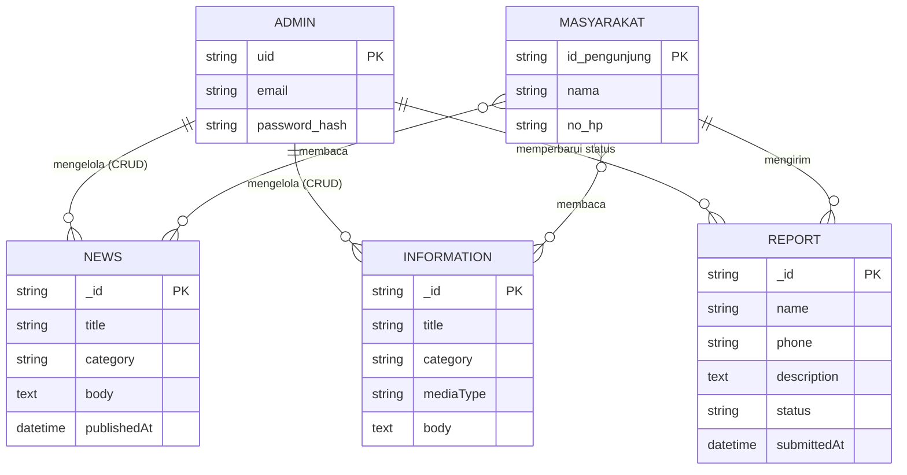
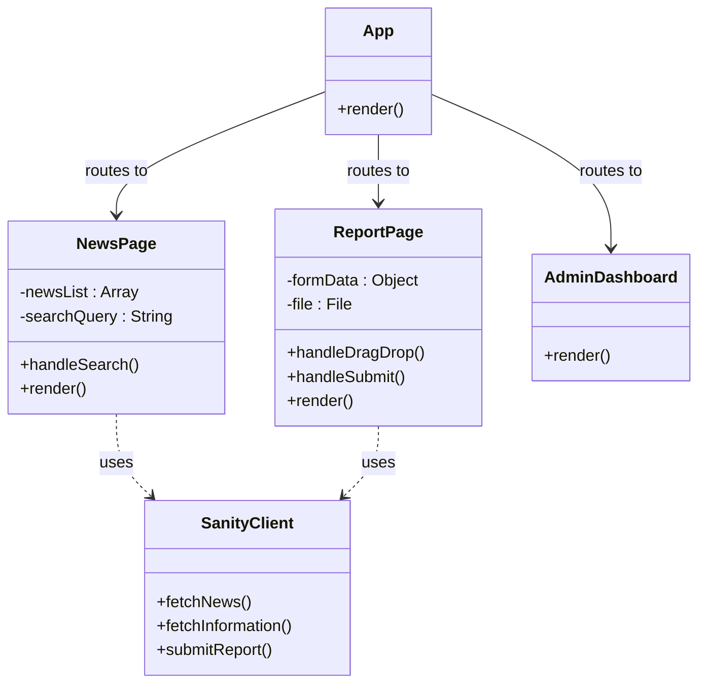
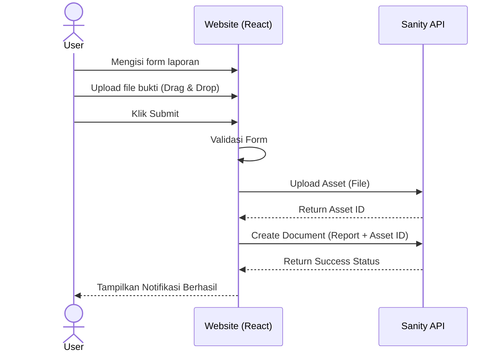
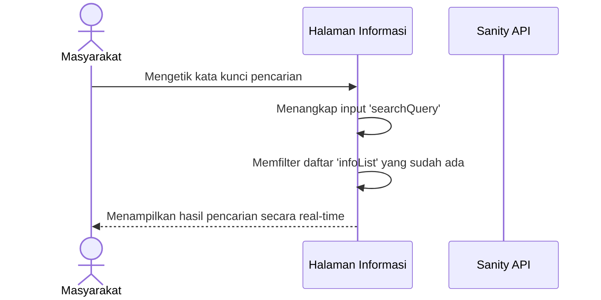

1.  # PENDAHULUAN
    

1.  Latar Belakang
    

Penyalahgunaan narkoba merupakan salah satu permasalahan sosial yang memberikan dampak besar terhadap kehidupan masyarakat, khususnya generasi muda. Penyebaran narkoba yang semakin luas menyebabkan perlunya upaya pencegahan dan penanggulangan yang dilakukan secara berkelanjutan. Dalam hal ini, Badan Narkotika Nasional (BNN) Kota Sawahlunto memiliki peran penting dalam memberikan edukasi, layanan publik, serta penanganan pengaduan masyarakat terkait penyalahgunaan narkoba.

Namun, penyampaian informasi kepada masyarakat masih memiliki beberapa kendala, seperti keterbatasan media informasi yang mudah diakses, kurangnya transparansi layanan, serta belum tersedianya media pengaduan online yang praktis dan efisien. Selain itu, masyarakat juga sering mengalami kesulitan dalam memperoleh informasi mengenai program BNN, berita kegiatan, layanan publik, dan prosedur pengaduan.

Berdasarkan permasalahan tersebut, diperlukan sebuah sistem berbasis website yang dapat menjadi media informasi, komunikasi, edukasi, dan layanan publik bagi masyarakat. Website resmi BNN Kota Sawahlunto diharapkan dapat membantu masyarakat memperoleh informasi secara cepat, mudah, dan terpercaya, sekaligus mempermudah pihak BNN dalam mengelola konten serta menindaklanjuti pengaduan masyarakat secara lebih efektif dan terstruktur.

2.  Rumusan Masalah
    

1.  Bagaimana merancang website resmi BNN Kota Sawahlunto sebagai media informasi dan layanan publik?
    
2.  Bagaimana menyediakan fitur pengaduan masyarakat yang mudah digunakan?
    
3.  Bagaimana membantu admin dalam mengelola konten website secara efektif?
    
4.  Bagaimana membangun sistem yang user-friendly dan mudah diakses masyarakat?
    

3.  Tujuan
    

1.  Merancang dan membangun website resmi BNN Kota Sawahlunto.
    
2.  Menyediakan media informasi dan edukasi terkait pencegahan narkoba.
    
3.  Menyediakan layanan pengaduan masyarakat berbasis website.
    
4.  Membantu admin dalam mengelola informasi dan pengaduan secara lebih efisien.
    

  
  
  
  
  

4.  Manfaat
    

1.  Bagi Masyarakat
    

-   Memudahkan masyarakat memperoleh informasi mengenai BNN Kota Sawahlunto.
    
-   Mempermudah masyarakat dalam menyampaikan pengaduan atau laporan secara online.
    
-   Memberikan akses edukasi mengenai bahaya narkoba.
    

  

2.  Bagi BNN Kota Sawahlunto
    

-   Membantu pengelolaan informasi dan layanan publik secara digital.
    
-   Mempermudah pengelolaan konten website dan pengaduan masyarakat.
    
-   Meningkatkan efektivitas penyampaian informasi kepada masyarakat.
    

5.  Ruang Lingkup
    

1.  Sistem dikembangkan berbasis website dan diakses melalui browser.
    
2.  Sistem menyediakan fitur profil, berita, layanan publik, edukasi, dan pengaduan masyarakat.
    
3.  Sistem memiliki halaman admin untuk pengelolaan konten website.
    
4.  Sistem tidak terintegrasi dengan sistem nasional BNN.
    
5.  Sistem hanya digunakan oleh masyarakat umum dan admin BNN Kota Sawahlunto.
    

  
  

m9TmKKj8F9JiwmPNWR/HG2f6XEdV+qKUsEl7oe5P547FwOYPe4ahCdIq+dXHPVm+TuA7APTk34oT4PGD3uwpbjxy+amGQ/yw+RB59/zN+OmKbUn7j6OKHJJU20/II+WBah6A+mAEgzuoSRGiyqmTreh9I9jst0IXzKf8JTuF11SPdI8WpOLtGQ6Fq5bzBgAT0LMPfiuaW0hSUPo4tfPCOJI9DTHpjGAemCS59dBtN4PZP3t8f44p34QNNVfdYiZFVT3uyxJJR1ye5OAe/P778aarexFpk8wHUzNVTPM4aoHTA9yIalSRuJtDRxwpWcSTXD37/bHv+nFu0qdUlJ0qfNEFo4lWnEjJAp3yB78g7/Yjl1te3FS+NSpK211edlq3LXNsGn0B7cW7SFypHi5O3WXyxTYsuE357g+xp3PXjJ18WhMtg3oJvJiDcKFFXFtIT0xsmK09+2cG2SPQBIAYJL+wMYB7Y45ypbSElS4NTikzHgIJstTzICR3OvcH9+OpcKyRXSPB0nblSo5AnIkOyxI5zpNCce3t7+xFAYNmijj25KG12SJFSyqHZLUVOAmfTHUzgn+/c2NMDPJKvrG0s3lBK5fjfcIYF3C5Mih7tRJPDqcsSAddfv8AUAC558I69RwptQqJOizqcKEidoNbaOpTiU7TkEfx8yAYBjub+2Ofpwt0jYmJyd0R9DTSl9tRlnq0aQk7Nh3JwDGMAL/UnBPtw9y+x1eYV4NY4jGjcFPD8tdW6knb7ENdEKCHqH/FtIlZzLwEa35L98GwOHJtQdwyU17e0tmdTyQEttVpkg2xz7A9ifoQxNWEJjbaOJ2nI98Se+Ss6Q4ZwwDHICQYxgkBc2JxydSIVNdjdbChckyFtUVZ+92MrJXZHIq7mcyAAOffnnn9uDyCkja25o5Ja5R5aTz9scVJRWlXGEqR8JOxcSPJX02hoaA7nUhrWKcZN3FanI5Y07Tv9OMVNTYzyPePIZkxwFLDLS9tVUgJb0ppJZVVXnBVqT66fgug+KrkCEMn6uD9P6NmMhGpiobnFxqq1qNqfk+OvIEL/vJGRoKTK8VhVcBe+GF2JJZsk4rau7/VFhYN+Np4yMjNZ79mPG5oW3Y0uOSsgHb/AFdSCr/8zeZGRkfL8fGaIJfgwMox84+fDSp1EZGR5m/1x2W8DaXqOGMc+KqIyMhLHzDHB9HfCfIwYB4NGRkXP9fgQTgVhgwMMa/hf0HbW8XCQkcXU9IrIDoHE8JvAVIIP6OHgkMGH+oXDF/UORkFW9GXwDCSS5ZMHAYL4g3D+D+PxYPN4IyMj7f/ACpsf9v+pdSfZ1/fmGdqNM3+GLPwdfwS4P6OsyXR0P0RkZBvnHdJzUSsOiJKvwc0ithATbMcnqpuDQ+If6o4sjIyMh7Q+EyiH2uw/iF+UhKuMRpjIyE6GAczwaIR0ZGRdCVg87jUSDoyMgrEHI6r9UDzoyMgqm+kg52J8G5ElJwbtVWQANoNPPN+Lg0zMpe4f58kX5vBGYbzTLAnJm4ZK7R/VruH/KL83gjIyN1k/NT7Dh/oCfKpTA4qVcUQcc8PahMQeu4XJblzigmD/wDqLg4YyMizOcekqmMh4gzAnwF/lIU5uR8p40wciHJgv/KD5Lg+mH4hfzw1IFqo5UurDxi/r4YyMjN5x9p/CozhPGEVxXWlwarSOx1Op+O7qQRz5g6Vqe7hMfXCrPj4b3x/LqxxkZDLJPs0pGu5KMWELjS3h/nPB/2rx/JGtkWqkjIk4Ux4i5CT5ZeH9GhGRkOoPsghm5Ad8VHKKL8DodINXwrNdwlhm0Afr+KFM7iv10ZGQZD9BZF9Ay0J/hGT0/0/zxZuMl2I+ND1P8fQjIyA5cPjB1HwcqSnv6Sv6+D/APY4yMjIapxwPMD/2Q==)

Gambar 2 Contoh judul gambar lebih dari satu baris maka baris kedua dimulai tepat di bawah huruf pertama judul gambar

2.  # METODE
    

Pada penelitian dan pengembangan sistem ini, penulis memilih untuk menggunakan metode pengembangan perangkat lunak *Agile* dengan kerangka kerja Scrum. Alasan utama penggunaan metode ini adalah karena sifatnya yang sangat fleksibel, sehingga penulis dapat dengan mudah melakukan penyesuaian jika ada perubahan atau tambahan fitur yang diminta oleh pihak BNN Kota Sawahlunto di tengah berjalannya proyek.

Pelaksanaan metode ini terbagi ke dalam beberapa tahapan utama. Tahap pertama adalah perencanaan (*sprint planning*), di mana penulis mengumpulkan daftar kebutuhan dari pihak BNN dan memecahnya menjadi beberapa target fitur yang akan dikerjakan. Setelah itu, masuk ke tahap desain, di mana penulis mulai membuat rancangan arsitektur basis data, diagram sistem, dan gambaran kasar antarmuka (*wireframe*). 

Tahap yang paling memakan waktu adalah tahap implementasi (*sprint execution*). Pada tahap ini, penulis membangun bagian *frontend* menggunakan React.js dan Tailwind CSS. Sementara itu, untuk *backend* atau pengelolaan datanya, penulis memanfaatkan layanan Sanity CMS. Setiap kali sebuah modul atau fitur selesai dibuat, penulis melakukan pengujian fungsionalitas (*testing*) untuk mencari *bug* yang mungkin terjadi, sebelum akhirnya didiskusikan kembali hasilnya.

3.  # HASIL DAN PEMBAHASAN
    

Dalam penulisan hasil dan pembahasan dapat dipisah sebagai bab Hasil dan bab Pembahasan, atau digabung menjadi bab Hasil dan Pembahasan. Pemisahan atau penggabungan kedua bab ini bergantung pada bidang studi, atau sesuai dengan arahan pembimbing.

1.  Requirement Gathering and Analysis
    

Requirement gathering merupakan tahapan awal dalam pengembangan sistem yang bertujuan untuk mengidentifikasi kebutuhan pengguna dan menentukan fungsi utama yang harus dimiliki oleh sistem. Pada proyek ini, requirement gathering dilakukan untuk mengetahui kebutuhan Website BNN Kota Sawahlunto sebagai media informasi, edukasi, komunikasi, dan layanan publik bagi masyarakat.

Proses requirement gathering dilakukan melalui identifikasi kebutuhan pengguna, analisis layanan yang dibutuhkan, serta pengelompokan fitur-fitur utama sistem. Dari proses tersebut diperoleh informasi mengenai kebutuhan masyarakat sebagai pengguna umum dan admin sebagai pengelola website.

1.  Deskripsi Sistem
    

Sistem yang dikembangkan adalah Website Resmi BNN Kota Sawahlunto yang berfungsi sebagai media informasi dan layanan publik terkait pencegahan serta penanggulangan penyalahgunaan narkoba. Website ini menyediakan informasi profil organisasi, berita dan kegiatan, layanan publik, program kerja, serta fasilitas pengaduan masyarakat secara online.

Selain digunakan oleh masyarakat umum, sistem juga menyediakan halaman admin yang digunakan untuk mengelola konten website dan memproses pengaduan masyarakat.

2.  SSR / TOR (Software/System Requirement Specification)
    

1.  Tujuan Sistem
    

Membangun website resmi BNN Kota Sawahlunto yang dapat membantu masyarakat memperoleh informasi dan layanan publik secara cepat, mudah, dan terpercaya.

2.  Ruang Lingkup Sistem
    

1.  Sistem berbasis website dan dapat diakses melalui browser.
    
2.  Sistem menyediakan informasi profil organisasi, berita, layanan publik, dan edukasi narkoba.
    
3.  Sistem menyediakan fitur pengaduan masyarakat.
    
4.  Sistem memiliki halaman admin untuk pengelolaan konten.
    
5.  Sistem tidak terintegrasi dengan sistem nasional BNN.
    

  

3.  Pengguna Sistem
    

1.  Masyarakat
    

Pengguna umum yang dapat mengakses informasi website dan mengirim pengaduan.

2.  Admin
    

Petugas BNN Kota Sawahlunto yang bertugas mengelola konten website dan pengaduan masyarakat.

4.  Kebutuhan Fungsional
    

  
  
  
  
  

2.  Design
    

Dalam merancang sistem ini, penulis membuat beberapa pemodelan untuk memperjelas alur kerja dan struktur datanya sebelum mulai menulis kode. Pemodelan ini dibuat menggunakan pendekatan terstruktur (ERD) dan pemodelan sistem berorientasi objek (UML).

### a. Entity Relationship Diagram (ERD)
Sistem website BNN Sawahlunto ini menggunakan Sanity CMS, yang pada dasarnya adalah database NoSQL. Namun, secara logis strukturnya dapat digambarkan menyerupai ERD tradisional dengan tiga dokumen utama, yaitu data berita (`news`), data edukasi (`information`), dan data aduan masyarakat (`report`).



### b. Class Diagram
Class diagram di bawah ini menunjukkan bagaimana komponen-komponen React pada *frontend* berinteraksi satu sama lain dan juga berinteraksi dengan API dari Sanity CMS. Komponen `App` bertindak sebagai *router* utama yang mengarahkan pengguna ke halaman yang sesuai.



### c. Activity Diagram (Pengiriman Pengaduan)
Salah satu fitur paling penting di website ini adalah fitur lapor/pengaduan. Berikut adalah diagram aktivitas yang menggambarkan langkah-langkah yang dilakukan oleh masyarakat saat ingin mengirimkan laporan indikasi penyalahgunaan narkoba.

```mermaid
activityDiagram
    start
    :User membuka halaman Lapor;
    :User mengisi form (Nama, Umur, No HP, Deskripsi);
    :User mengunggah bukti (Drag & Drop / Pilih File);
    if (Form Valid?) then (Ya)
        :Sistem mengunggah file ke Sanity Storage;
        :Sistem menyimpan data laporan ke Sanity DB;
        :Tampilkan pesan Sukses;
    else (Tidak)
        :Tampilkan pesan Error (Wajib Isi);
    endif
    stop
```

### d. Sequence Diagram (Pengiriman Pengaduan)
Berikut adalah sequence diagram untuk alur pengiriman laporan.



### e. Desain Lofi - Hifi
Pada tahap awal desain antarmuka, penulis membuat sketsa kasar (Low-Fidelity) untuk sekadar menentukan posisi elemen-elemen seperti letak menu, letak gambar utama (*hero*), dan letak formulir. Setelah tata letaknya disetujui, penulis mulai mengembangkan desain High-Fidelity dengan menerapkan warna identitas BNN (biru) dan memastikan antarmukanya terlihat modern dengan menggunakan efek transparansi (*glassmorphism*).

---

3.  Implementasi
    

Tahap implementasi adalah waktu di mana penulis mulai mengoding sistem berdasarkan desain yang sudah dibuat. Pengerjaan kodenya sendiri banyak berkutat pada penggunaan React.js untuk logika *frontend* dan Tailwind CSS untuk *styling* tampilannya. 

### a. Penjelasan Fitur dan Implementasi
Fitur-fitur utama yang berhasil diimplementasikan oleh penulis dalam proyek ini antara lain:
Pertama, halaman pengaduan masyarakat. Di sini penulis membuat form yang mendukung fitur "Drag & Drop", jadi pengguna bisa langsung menarik foto bukti laporan ke dalam kotak yang disediakan tanpa harus menekan tombol *browse* file secara manual. 
Kedua, halaman berita dan informasi. Penulis menerapkan fitur pencarian langsung di sisi *client* sehingga hasil pencarian bisa langsung muncul tanpa perlu memuat ulang halaman (*loading*).
Ketiga, halaman admin. Penulis membuat panel khusus yang hanya bisa diakses oleh admin BNN untuk mengelola semua konten. Di sini admin bisa dengan mudah menambah, mengubah, atau menghapus artikel.

Dalam pengembangan ini, penulis bertanggung jawab penuh atas pembuatan kode program mulai dari *frontend* hingga menyambungkannya dengan layanan Sanity. Sementara itu, pihak admin BNN nantinya akan bertindak sebagai pengguna akhir yang mengoperasikan halaman admin tersebut sehari-hari.

### b. Screenshot Hasil

*(Catatan: Screenshot asli dapat disisipkan di sini pada dokumen final)*
- Gambar 3.1 Tampilan Beranda
- Gambar 3.2 Tampilan halaman form pengaduan
- Gambar 3.3 Tampilan dashboard admin untuk kelola berita

### c. Potongan Kode Penting
Berikut adalah implementasi fungsi **Drag and Drop** pada halaman pengaduan (`ReportPage.jsx`):

```javascript
  const handleDragOver = (e) => {
    e.preventDefault(); // Mencegah browser membuka file secara default
    setIsDragging(true); // Mengubah state visual area drop
  };

  const handleDragLeave = (e) => {
    e.preventDefault();
    setIsDragging(false); // Mengembalikan state visual saat cursor keluar
  };

  const handleDrop = (e) => {
    e.preventDefault();
    setIsDragging(false);
    const droppedFile = e.dataTransfer.files[0]; 
    validateAndSetFile(droppedFile); 
  };
```
Potongan kode di atas terletak di file `ReportPage.jsx`. Penulis menggunakan event bawaan dari HTML seperti `onDragOver` dan `onDrop`. Bagian terpenting dari kode ini adalah pemanggilan fungsi `e.preventDefault()`. Tanpa fungsi ini, browser akan menganggap file yang dijatuhkan sebagai file yang ingin dibuka di tab baru, sehingga akan merusak alur pengisian form.

Berikut adalah implementasi **Pencarian Dinamis** pada halaman Admin (`AdminInformation.jsx`):

```javascript
  const filteredList = infoList.filter(item =>
    item.title?.toLowerCase().includes(searchQuery.toLowerCase()) ||
    item.category?.toLowerCase().includes(searchQuery.toLowerCase())
  );
```
Potongan kode ini berada di halaman admin. Penulis membuat fungsi filter sederhana menggunakan *method* `.filter()` bawaan JavaScript. Penulis juga menambahkan fungsi `.toLowerCase()` pada kata kunci maupun judul aslinya, hal ini dilakukan agar saat admin mencari dengan huruf kecil maupun huruf kapital, datanya tetap bisa ditemukan secara akurat.

---

4.  Integration & Testing
    

Tahapan integrasi dan pengujian dilakukan untuk memastikan semua kode yang ditulis oleh penulis dapat berjalan lancar saat digabungkan, terutama saat website mencoba menarik data dari Sanity CMS.

### a. Proses Integrasi Sistem
Dalam mengintegrasikan *frontend* dengan database Sanity, penulis melakukan pengaturan pada file konfigurasi `sanityClient`. Di sana, penulis memasukkan ID proyek dari Sanity agar aplikasi React tahu dari mana ia harus mengambil data. Setelah semuanya tersambung di lingkungan lokal (komputer penulis), kode sumbernya kemudian diunggah ke repositori GitHub. 

Untuk proses peluncuran (*deployment*), penulis menggunakan platform layanan *hosting* Vercel. Vercel sangat memudahkan penulis karena sudah terhubung langsung dengan GitHub. Jadi, setiap kali penulis menyimpan dan mendorong (*push*) perubahan kode ke GitHub, Vercel akan secara otomatis membangun ulang websitenya.

### b. Alamat Website (Deployment)
Website hasil pengembangan penulis dapat diakses secara publik pada alamat:
**[https://bnn-sawahlunto.vercel.app/](https://bnn-sawahlunto.vercel.app/)**

### c. Skenario Pengujian (Test Cases) & Hasil
Pengujian dilakukan menggunakan metode *Black-box Testing* (berfokus pada fungsionalitas UI).

| ID Test | Skenario Pengujian | Langkah Pengujian | Hasil yang Diharapkan | Status |
|---|---|---|---|---|
| TC-01 | Akses Halaman Utama | Buka URL website public | Halaman Beranda tampil sempurna beserta gambar struktur organisasi | ✅ Berhasil |
| TC-02 | Filter Kategori Berita | Buka halaman Berita, klik salah satu tombol kategori (misal: "Sosialisasi") | Hanya berita dengan kategori yang dipilih yang tampil | ✅ Berhasil |
| TC-03 | Pencarian Berita (*Real-time*) | Ketik kata kunci pada kotak pencarian di halaman Berita | Menampilkan berita yang relevan dengan kata kunci secara instan tanpa *reload* | ✅ Berhasil |
| TC-04 | Validasi Form Pengaduan Kosong | Klik submit tanpa mengisi field wajib di halaman Lapor | Muncul peringatan visual bahwa kolom wajib diisi | ✅ Berhasil |
| TC-05 | Upload Bukti Laporan (Drag & Drop) | *Drag and drop* file gambar (JPG/PNG) ke area upload form lapor | Gambar berhasil dipilih dan pratinjau nama/ukuran file muncul | ✅ Berhasil |
| TC-06 | Validasi Tipe File Laporan | Mengunggah file PDF atau teks (.txt) ke form bukti laporan | Muncul *error* peringatan bahwa format file tidak didukung (harus gambar) | ✅ Berhasil |
| TC-07 | Kirim Pengaduan Berhasil | Isi semua form dengan benar, lampirkan bukti gambar, klik Submit | Pesan sukses muncul dan data laporan terkirim ke database Sanity CMS | ✅ Berhasil |
| TC-08 | Tampilan Thumbnail (*Line Clamp*) | Lihat daftar grid berita atau informasi | Teks judul yang terlalu panjang otomatis terpotong menjadi 3 baris dengan *ellipsis* (`...`) | ✅ Berhasil |
| TC-09 | Integrasi *Web Share API* | Buka detail berita, klik tombol bagikan (WhatsApp, X, Facebook) | Jendela *pop-up* terbuka untuk membagikan tautan URL secara langsung | ✅ Berhasil |
| TC-10 | Putar Video Edukasi Publik | Buka halaman detail Informasi yang memiliki tautan YouTube | *Embed* pemutar video YouTube muncul dan bisa diputar di dalam website | ✅ Berhasil |
| TC-11 | Keamanan Rute (*Protected Route*) | Buka tautan `/admin/dashboard` secara manual di *address bar* tanpa *login* | Akses ditolak dan pengguna langsung dialihkan secara otomatis ke halaman Login | ✅ Berhasil |
| TC-12 | Login Admin (Gagal) | Masuk ke halaman login `/admin`, masukkan email/password yang salah | Proses otentikasi ditolak dan muncul pesan error (*kredensial tidak valid*) | ✅ Berhasil |
| TC-13 | Login Admin (Berhasil) | Masukkan email dan password Firebase yang valid | Otentikasi berhasil dan diarahkan ke Dashboard Panel Admin | ✅ Berhasil |
| TC-14 | Tambah Berita (Admin) | Di menu admin berita, klik Tambah, isi form (termasuk upload *cover* gambar), lalu simpan | Data tersimpan ke server Sanity, gambar terunggah, dan tabel admin ter-update | ✅ Berhasil |
| TC-15 | Edit Berita / Informasi (Admin) | Klik tombol edit pada salah satu artikel, ubah judul/isi, lalu *Update* | Perubahan tersimpan dan otomatis ter-update di antarmuka publik | ✅ Berhasil |
| TC-16 | Hapus Konten (Admin) | Klik tombol hapus (ikon tong sampah) pada salah satu data tabel | Data berhasil dihapus dari tabel *frontend* dan database *backend* Sanity | ✅ Berhasil |
| TC-17 | Pencarian Data Admin (*Live Search*) | Ketik kata kunci di kolom pencarian tabel pada halaman Admin Berita/Informasi | Tabel langsung menyaring (*filter*) data yang cocok secara *real-time* | ✅ Berhasil |
| TC-18 | Kelola Status Laporan Pengaduan | Buka halaman Admin Laporan, ubah status laporan dari "Pending" menjadi "Selesai" | Status pada database diperbarui dan tabel admin merefleksikan perubahan warna status | ✅ Berhasil |
| TC-19 | Proses *Logout* (Keluar) Sesi Admin | Klik tombol *Logout* di dalam Dashboard Admin | Sesi otentikasi terhapus dan admin dikembalikan ke halaman Login awal | ✅ Berhasil |
| TC-20 | Responsivitas Antarmuka (*Mobile View*) | Buka website menggunakan *browser smartphone* (atau *inspect element* ukuran HP) | Menu navigasi berubah menjadi *Hamburger Menu*, tabel admin bisa di-*scroll* horizontal, layout menyesuaikan layar | ✅ Berhasil |

*Seluruh test case di atas telah diuji pada tahap UAT (User Acceptance Testing) dan menunjukkan hasil yang sesuai dengan yang diharapkan.*

  

4.  # SIMPULAN DAN SARAN
    

1.  Simpulan
    

1.  Simpulan
    

Dari proses perancangan hingga pengujian yang telah penulis laksanakan, terdapat beberapa kesimpulan yang bisa diambil terkait pembangunan Website Resmi BNN Kota Sawahlunto ini.

Pertama, penulis telah berhasil membangun sebuah sistem berbasis website menggunakan kombinasi React.js dan Sanity CMS. Website ini terbukti bisa menjadi wadah untuk menyampaikan profil instansi, berita terkini, dan informasi edukasi seputar bahaya narkoba.

Kedua, sistem pelaporan pengaduan masyarakat yang selama ini mungkin terkendala secara teknis sekarang bisa dilakukan dengan lebih interaktif. Penulis menambahkan fitur "drag and drop" untuk mengunggah file bukti agar proses pengisian form dirasa lebih mudah oleh pengguna.

Terakhir, website ini juga memfasilitasi kebutuhan pihak BNN sendiri lewat halaman admin. Dengan halaman ini, petugas tidak perlu mengubah kode apapun saat ingin menambah atau memperbarui artikel berita, semuanya sudah tertata di panel yang cukup mudah digunakan. Secara keseluruhan antarmuka yang dikembangkan juga sudah cukup rapi dan responsif meski dibuka dari layar ponsel.

2.  Saran
    

Meski website ini sudah berfungsi dengan baik sesuai target awal, penulis menyadari masih banyak ruang untuk perbaikan. Bagi pengembangan di masa mendatang, penulis menyarankan beberapa hal:

Saran pertama adalah soal notifikasi. Saat ini masyarakat yang melapor belum mendapat umpan balik (seperti notifikasi email) mengenai status laporan mereka. Akan sangat baik jika ke depannya ada fitur integrasi email otomatis agar masyarakat tahu laporannya sudah ditangani.

Saran kedua terkait dengan integrasi data berskala nasional. Karena sistem ini masih mencakup lingkup BNN Kota Sawahlunto, akan lebih sempurna apabila database laporan ini kelak dapat tersambung langsung dengan sistem informasi yang ada di pusat (BNN RI).

Saran terakhir adalah penambahan fitur statistik di dashboard admin. Saat ini admin hanya bisa mengelola data konten. Ke depannya, alangkah baiknya jika ada grafik atau analitik yang memperlihatkan halaman apa saja yang paling banyak dikunjungi oleh masyarakat.

DAFTAR PUSTAKA

1. Facebook Open Source. (2024). *React – A JavaScript library for building user interfaces*. Diakses dari https://react.dev/
2. Sanity.io. (2024). *Sanity Documentation: The structured content platform*. Diakses dari https://www.sanity.io/docs
3. Tailwind Labs. (2024). *Tailwind CSS - Rapidly build modern websites without ever leaving your HTML*. Diakses dari https://tailwindcss.com/
4. Vercel Inc. (2024). *Vercel Documentation - Frontend cloud platform*. Diakses dari https://vercel.com/docs
5. Badan Narkotika Nasional Republik Indonesia. (2020). *Pedoman Pelaksanaan P4GN (Pencegahan, Pemberantasan, Penyalahgunaan, dan Peredaran Gelap Narkotika)*. Jakarta: BNN RI.

LAMPIRAN

**Lampiran 1: Activity Diagram Tambahan (Pengelolaan Berita oleh Admin)**
*(Catatan: Diagram ini menunjukkan alur admin dalam menambah berita baru)*

```mermaid
activityDiagram
    start
    :Admin Login ke Dashboard;
    :Admin memilih menu Kelola Berita;
    :Admin mengklik tombol "Tambah Berita";
    :Sistem menampilkan Form Berita;
    :Admin mengisi Judul, Kategori, Isi, dan Upload Gambar;
    :Admin mengklik Simpan;
    if (Validasi Lengkap?) then (Ya)
        :Sistem mengunggah gambar ke Sanity Storage;
        :Sistem menyimpan dokumen Berita ke Sanity Database;
        :Sistem memperbarui tabel daftar berita;
    else (Tidak)
        :Sistem menampilkan pesan Error wajib isi;
    endif
    stop
```

**Lampiran 2: Sequence Diagram Tambahan (Pencarian Informasi Publik)**
*(Catatan: Diagram ini menunjukkan alur saat masyarakat mencari informasi)*


